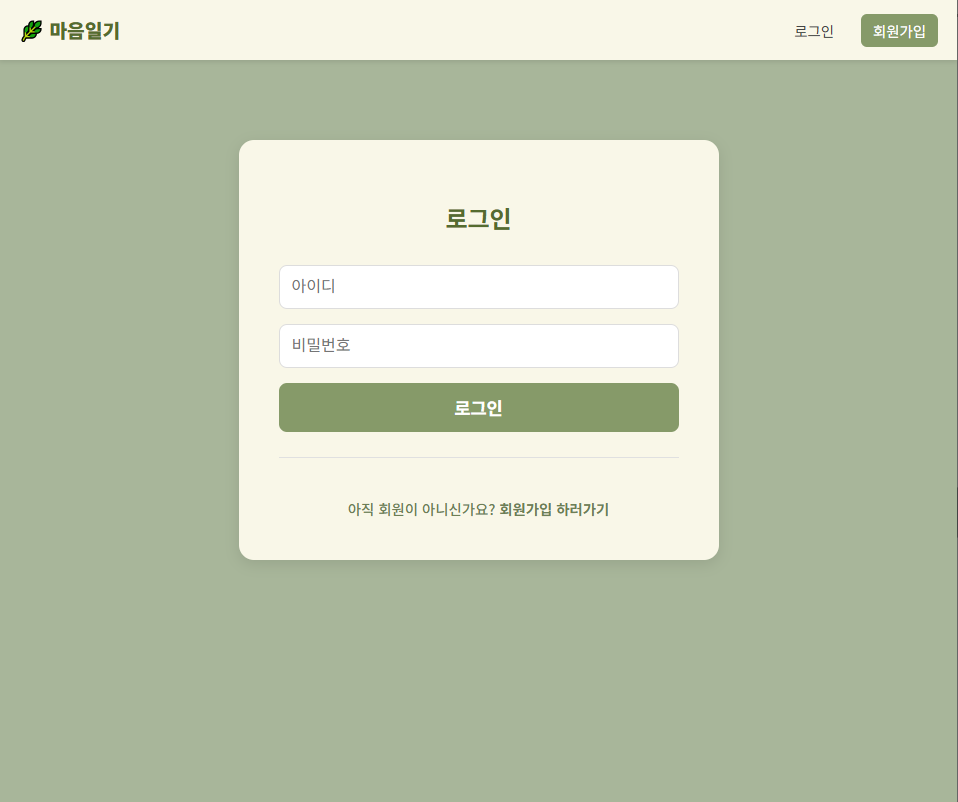
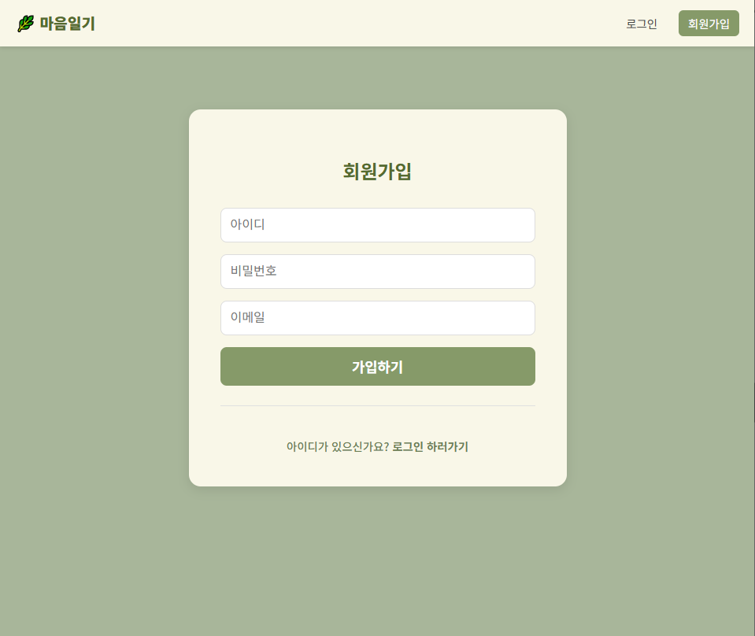
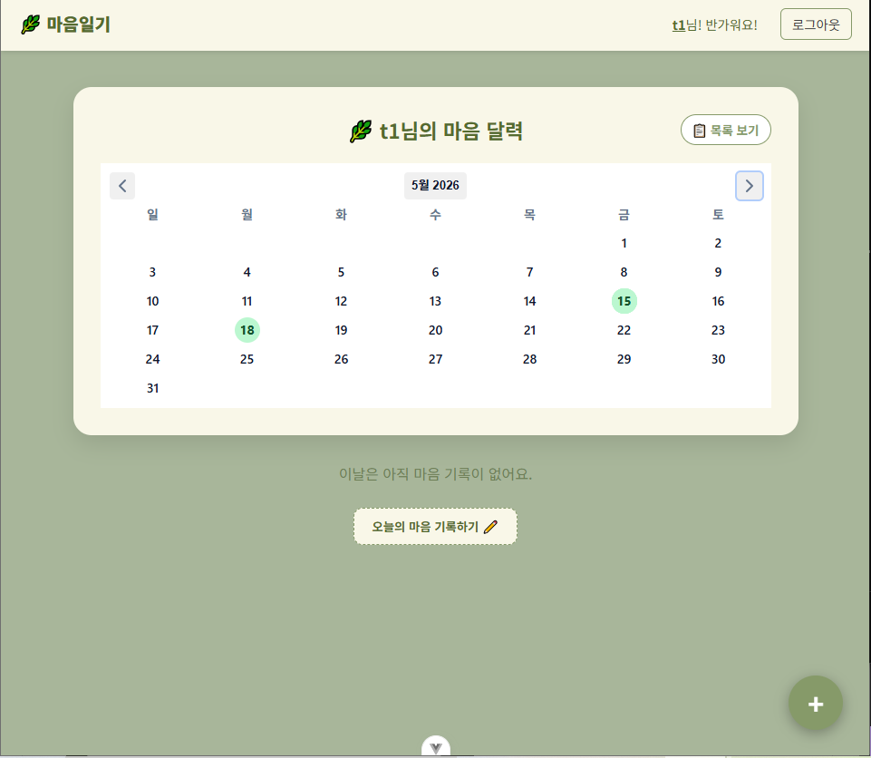
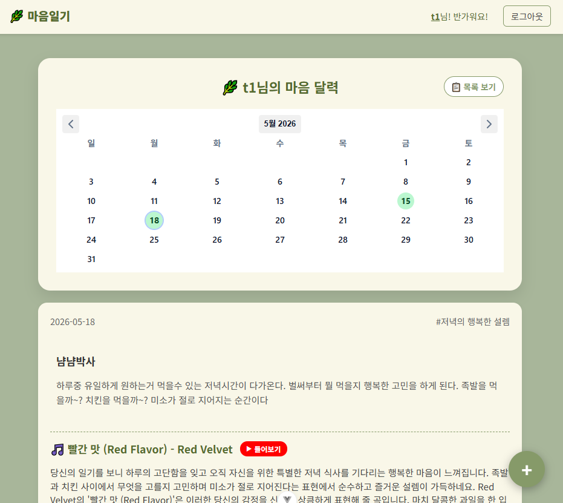
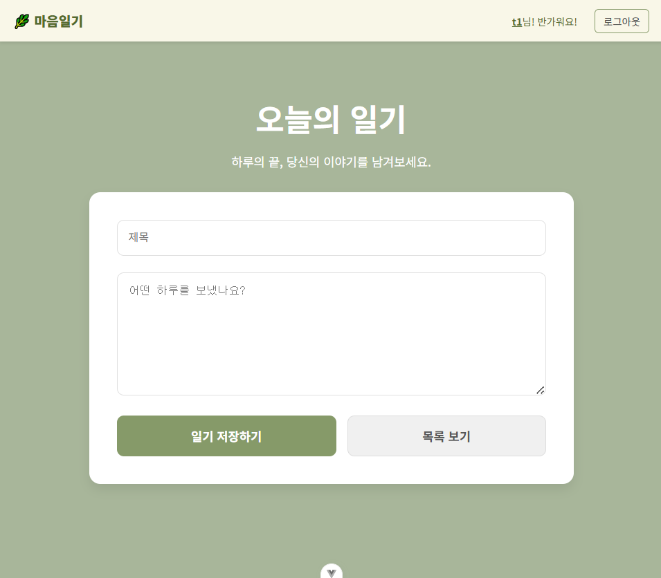
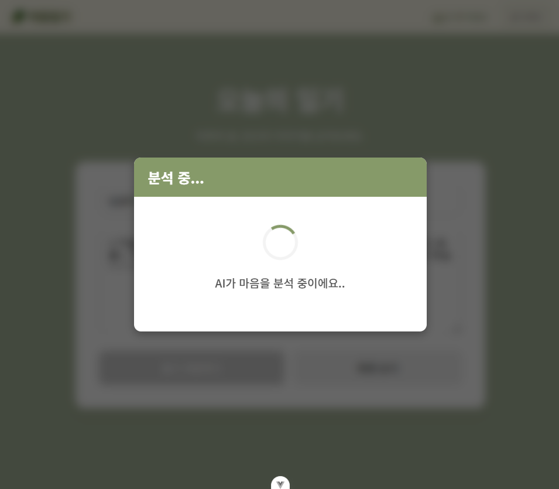
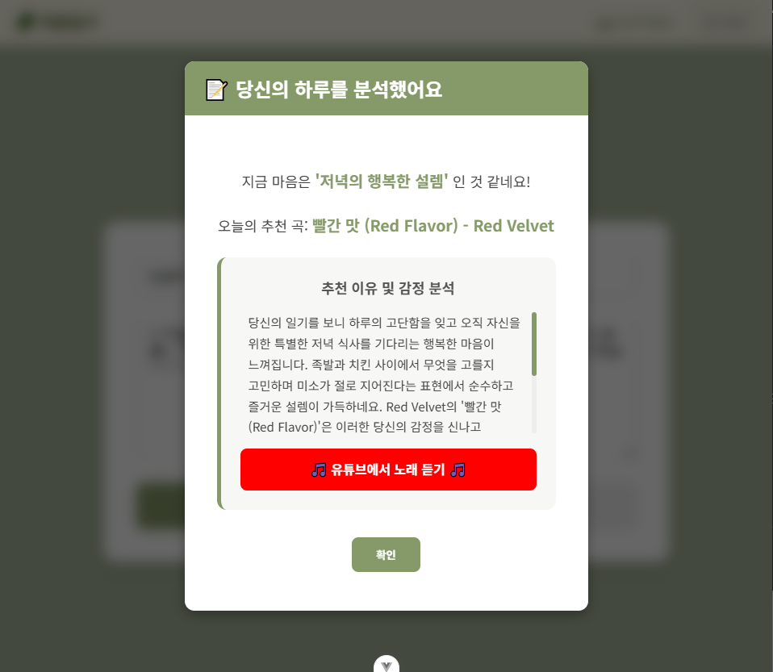
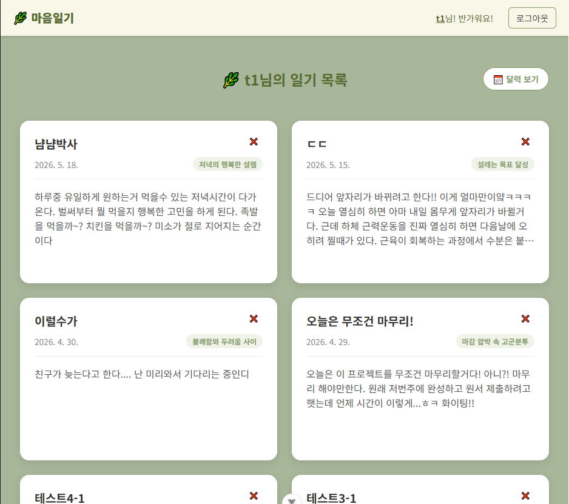
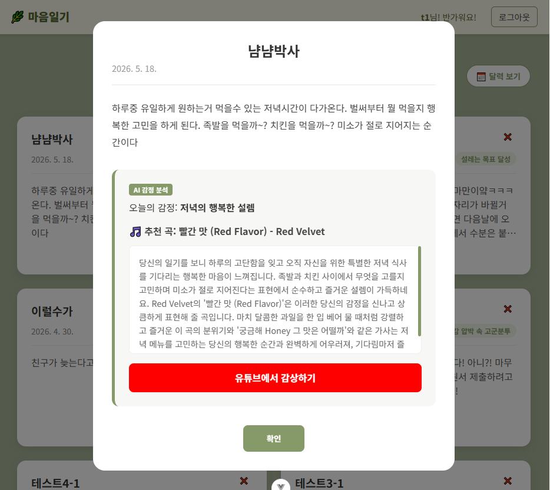

# 🌿 Light of Life

**사용자의 일기 텍스트를 AI로 분석하여 깊이 있는 감정 분석 리포트를 제공하고, 마음에 위로가 되는 맞춤형 음악(YouTube 링크)을 추천하는 감성 일기 웹 서비스 입니다.**

---

## 🎯 기획 배경

일기는 하루의 감정을 정리하고 스스로를 돌아보는 데 좋은 도구이지만 대다수의 사용자들에게는 '단순 기록'으로 끝나는 경우가 많습니다. "내가 오늘 왜 이런 감정을 느꼈지?", "이럴 때 내 마음을 달래줄 음악은 없을까?"라는 고민에서 본 프로젝트가 시작되었습니다.

Light of Life는 사용자의 감정을 단순히 기록하는 것을 넘어, AI 기술을 통해 감정 데이터를 시각화하고 맞춤형 음악 추천까지 연결함으로써 사용자에게 더 깊은 몰입감과 정서적 위로를 제공하는 것을 목표로 합니다.

---

## 🧠 핵심 기능

1. 🌿 마음 달력 (대시보드): 일기를 기록한 날짜를 달력에 하이라이트(초록 점)로 표시하여 한눈에 나의 감정 기록 궤적을 추적할 수 있습니다.

2. 🎭 AI 실시간 감정 분석: 일기를 작성하면 AI가 문맥을 분석하여 대표 감정 태그를 도출합니다.

3. 🎵 맞춤형 힐링 음악 추천: 분석된 감정 상태에 최적화된 추천 곡명과 추천 이유, 즉시 청취 가능한 유튜브(YouTube) 링크 버튼을 제공합니다.

4. 📋 히스토리 관리: 과거에 작성했던 일기와 AI의 분석 리포트를 목록 및 모달 창을 통해 언제든지 다시 확인할 수 있습니다.

---

## 📷 서비스 시연 및 화면 구성
1. 로그인 및 회원가입 화면

<p align='left'>
  
  
</P>

2. 달력 (메인 대시보드)

<p align='left'>
  
  
</P>

3. 일기 작성 화면

<p align='left'>
  
</P>

4. AI 분석화면

<p align='left'>
  
  
  
</P>

5. 일기 작성 리스트

<p align='left'>
  
  
</P>

---

## 🚀 AI 아키텍처 고도화 비교 실험

본 프로젝트는 텍스트 감정 분석 및 음악 추천 기능의 Latency(대기 시간) 단축과 데이터 정형화를 목적으로 **Hugging Face 모델 연동 구조**와 **Gemini 단독 구조** 간의 비교 실험 및 리팩토링을 진행했습니다.

### 📊 AI 모델 파이프라인 변천사

* **[기존: 1세대 하이브리드 아키텍처]**
    일기 작성 ➡️ Hugging Face API (감정 텍스트 분류) ➡️ 결과 파싱 ➡️ Gemini API 전달 (음악 추천 및 이유 생성) ➡️ 프론트엔드 반환 `(총 2회 API 호출)`
* **[현재: 2세대 단독 올인원 아키텍처]**
    일기 작성 ➡️ Gemini 2.0 Flash API (감정 맥락 분석 + 음악 매칭 + 유튜브 URL 검색을 프롬프트 엔지니어링으로 동시 처리) ➡️ 구조화된 JSON 반환 `(단 1회 API 호출)`

### 📈 아키텍처 비교 분석 결과

| 비교 지표 | [기존] Hugging Face + Gemini 하이브리드 | [현재] Gemini 2.0 Flash 단독 (최적화) |
| :--- | :--- | :--- |
| **시스템 복잡도** | **높음** (두 채널의 API 가동, 서로 다른 Response 포맷 핸들링 필요) | **낮음** (단일 API 엔드포인트 관리로 백엔드 코드 경량화) |
| **네트워크 호출 (Round Trip)** | 총 2회 (Client ➡️ 서버 ➡️ HF API ➡️ Gemini API) | **단 1회** (Client ➡️ 서버 ➡️ Gemini API) |
| **평균 응답 속도 (Latency)** | 약 3.5초 ~ 5초 (HF 프리티어 모델의 콜드 스타트 및 2차 API 대기 시간 누적) | **약 1.2초 ~ 1.5초** (호출 단일화 및 Flash 모델 특유의 빠른 인퍼런스 속도 확보) |
| **데이터 파싱 안정성** | **취약함** (HF가 뱉은 감정 단어 파싱 에러 및 Gemini의 비정형 텍스트 변환 에러 발생 위험 누적) | **강력함** (`response_mime_type: 'application/json'` 구조화 출력 설정을 통한 무결성 보장) |
| **문맥(Context) 이해도** | **제한적** (HF 분류기가 단어 위주로 감정을 1차 재단하여, Gemini가 전체 일기 맥락을 깊게 인지하기 어려움) | **매우 높음** (일기 전체의 행간, 비유적 우울감, 반어법까지 LLM이 통으로 분석하여 정밀한 매칭 가능) |

> 💡 **인프라 선회 배경**
> 극초기 기획 단계에서는 KoNLPy(Okt) 형태소 분석기와 KNU 감성 사전을 결합한 규칙 기반 시스템을 구상했으나 단순 단어 매칭 방식으로는 "어이가 없다"와 같은 문맥적 의미나 강조어 가중치 처리에 한계가 있어 LLM 기반 아키텍처로 전면 선회하였습니다.

---

## 🛠️ 주요 구현 및 리팩토링 포인트 (Refactoring)

정보처리기사 소프트웨어 공학 지식을 기반으로 서비스의 안정성, 보안성, 무결성을 확보한 핵심 구현 포인트입니다.

### ① 엄격한 구조화 출력 (Strict Structured Outputs) 기반 AI 연동
* **구현 배경**: LLM 단독 구조로 변경할 때 가장 큰 리스크는 AI가 무작위 텍스트(예: *"추천해 드리는 노래는..."*)를 섞어 반환하여 백엔드에서 JSON 파싱 에러(500 에러)를 유발한다는 점이었습니다.
* **해결 방법**: Gemini API 호출 config에 `'response_mime_type': 'application/json'` 스키마를 강제 적용했습니다. 이로 인해 AI가 사설 없이 정확히 백엔드가 요구한 `emotion`, `recommendation_song`, `recommendation_reason`, `youtube_url` 키 값을 가진 JSON 규격만 반환하도록 설계하여 데이터 파싱 오류를 **0%**로 안정화했습니다.

### ② 보안성 강화: 접근 제어 및 환경 변수(.env) 아키텍처 분리
* **구현 배경**: 하드코딩된 Django JWT 시크릿 키, 구글 제미나이 API Key가 소스코드에 그대로 노출되어 GitHub 업로드 시 오픈소스 보안 탈취 위험에 직면했습니다. 또한, 다른 사용자의 일기 데이터가 유출 및 삭제되는 접근 제어 결함이 발견되었습니다.
* **해결 방법**: 백엔드(`python-environ`) 및 프론트엔드(`import.meta.env`) 환경 변수 시스템을 구축하여 모든 기밀 데이터를 `.env` 파일로 격리하고 `.gitignore` 설정을 통해 보안 기밀성을 확보했습니다. 더불어 장고 뷰셋(`ModelViewSet`)의 `get_queryset` 메서드를 `Diary.objects.filter(author=self.request.user)` 구조로 리팩토링하여 **인가(Authorization)된 본인의 일기만 조회 및 삭제**가 가능하도록 철저한 데이터 격리를 구현했습니다.

### ③ 데이터 무결성 확보: VCalendar 달력 날짜 매칭 버그 픽스
* **구현 배경**: 장고(Django)가 생성한 생성일 타임스탬프 필드의 시간대(Timezone ISO-8601) 정보 차이로 인해 프론트엔드 달력 라이브러리(VCalendar)가 일기 작성일을 인식하지 못해 달력 대시보드 하이라이트가 누락되는 현상이 있었습니다.
* **해결 방법**: 시간 단위를 배제하고 일자 단위 매칭을 제공하기 위해 백엔드 모델의 순수 일자 데이터(`date`) 필드를 매칭 키로 지정하고, JavaScript의 Date 객체 컨버팅 포맷을 일치시켜 달력 대시보드 기능을 정상화했습니다.

---

## 🛠️ Tech Stack

### 💻 Frontend
* Vue 3 (Composition API, `<script setup>`)
* Vue Router / Axios
* VCalendar (달력 대시보드 및 마크 기능 구현)

### ⚙️ Backend
* Django / Django REST Framework (DRF)
* Simple JWT (토큰 기반 사용자 인증 및 인가 관리)

### 🤖 AI & Infrastructure
* Google Gemini 2.0 Flash API (Structured JSON Mode)
* Git / GitHub (형상 관리 및 브랜치 전략)

### 기타
* django-environ (환경 변수 관리)

---

## 🚀 실행 방법

### 1. 레포지토리 클론
```bash
git clone https://github.com/eumdum/Light_of_Life.git
cd Light_of_Life
```

### 2. 가상환경 생성 및 활성화
``` bash
python -m venv venv
venv\Scripts\activate
```
### 3. 패키지 설치
```bash
pip install -r requirements.txt
```

### 4. 환경 변수 설정
* **Backend (`back/.env`)**
    ```env
    SECRET_KEY=your_django_secret_key
    DEBUG=True
    GOOGLE_API_KEY=your_gemini_api_key
    ```

* **Frontend (`front/.env`)**
    ```env
    VITE_API_BASE_URL=http://localhost:8000/api/
    ```
    
### 5. 데이터베이스 마이그레이션
```bash
python manage.py migrate
```

### 6. 백엔드 서버 실행
```bash
# 프로젝트 루트(Light_of_Life) 폴더에서 백엔드 폴더로 이동 후 가상환경 실행
.\venv\Scripts\activate 
python manage.py runserver
```

### 7. 프론트엔드 실행
```bash
# 프로젝트 루트(Light_of_Life) 폴더 기준 프론트엔드로 이동
cd front 
# 필요한 프론트엔드 라이브러리(VCalendar, Axios 등) 통전 설치
npm install
# 프론트엔드 개발 서버 가동
npm run dev
```

---