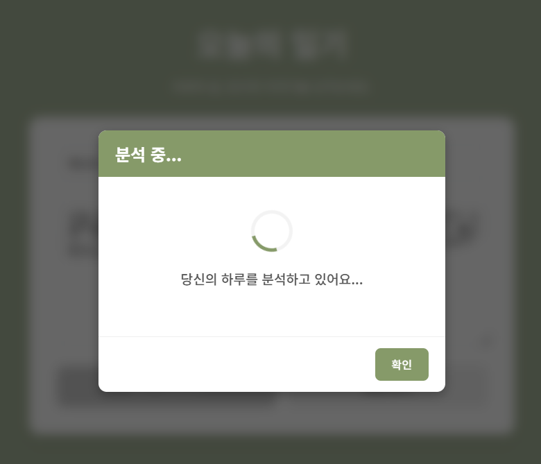
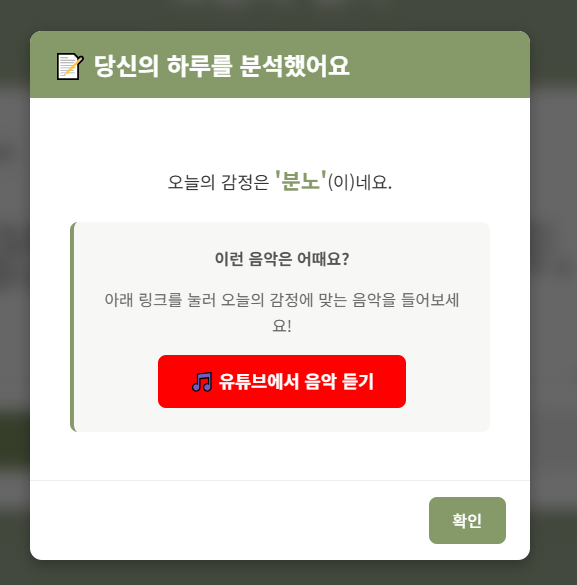

# 🌙 Light of Life

**텍스트 감정 분석 기반 음악 추천 일기 웹 서비스**

---

## 📌 프로젝트 소개

사용자가 일기를 작성하면 텍스트를 분석하여 감정을 도출하고,
해당 감정에 맞는 음악을 추천해주는 웹 서비스입니다.

단순 기록을 넘어, 감정 데이터를 기반으로 사용자 경험을 확장하는 것을 목표로 합니다.

---

## 🎯 기획 배경

일기는 감정을 정리하는 데 도움이 되지만, 단순 기록으로 끝나는 경우가 많습니다.  
이 프로젝트는 사용자의 감정을 분석하고, 그 결과를 바탕으로 음악 추천까지 연결하여 더 몰입감 있는 기록 경험을 제공하고자 기획했습니다.

---

## 🧠 핵심 기능

### 1. 감정 분석 (Core Feature)

* 형태소 분석 기반 텍스트 처리 (KoNLPy - Okt)
* 감정 사전 기반 점수 계산 (KNU 감성 사전 활용)
* 커스텀 감정 사전 추가
* 부정어 및 강조어 처리

  * 예: "너무 좋다" → 가중치 증가
  * 예: "어이가 없다" → 부정 처리

---

### 2. 감정 점수 계산 로직

* 감정 단어별 기본 점수 부여
* 강조어(booster) → 점수 가중치 적용
* 부정어 → 감정 반전 처리
* 최종 감정 분류

| 점수 범위 | 감정 |
| ----- | -- |
| ≥ 3   | 행복 |
| ≥ 1   | 평온 |
| ≤ -1  | 슬픔 |
| ≤ -3  | 분노 |
| 기타    | 중립 |

---

### 3. 일기 작성 및 감정 결과 확인
* 사용자가 일기를 입력하면 감정 분석 결과 제공
* 감정 상태를 직관적으로 확인 가능

---

### 4. 음악 추천 (구현 예정 / 확장 기능)

* 감정 결과 기반 유튜브에서 음악 추천
* Spotify / YouTube API 연동 예정

---

### 5. 일기 기록 기능

* 사용자가 일기 작성
* 감정 결과와 함께 저장
* 감정 데이터 기반 확장 가능

---

## ⚙️ 감정 분석 로직

```text
1. 텍스트 입력
2. 전처리 (치환, 불용어 제거)
3. 형태소 분석 (Okt)
4. 감정 단어 추출
5. 점수 계산
   - 기본 점수
   - 강조어 반영
   - 부정어 반영
6. 총합 계산
7. 감정 분류
```

---

## 🧩 감정 점수 계산 방식
* 기본점수: 감정 사전에 등록된 원래 점수
* 최종점수: 강조어, 부정어 반영 후 실제 계산에 사용되는 점수
  예시:
  * 좋다 → 기본점수 2
  * 너무 좋다 → 최종점수 3.0 (2 × 1.5)

---

## 🛠 기술 스택

### Backend

* Django
* Django REST Framework

### NLP / AI

* KoNLPy (Okt)
* KNU 감성 사전
* Hugging Face (확장 예정)

### Frontend

* Vue.js

### 기타

* 환경 변수 관리 (django-environ)

---

## 🔥 주요 구현 포인트

### ✔ 형태소 기반 감정 분석

단순 키워드 포함 여부가 아니라 문자의 형태소를 분석하여 감정 단어를 추출하도록 구현했습니다.

### ✔ 부정어 처리 개선

'안', '못', '없다' 등과 같은 부정어가 문장 전체가 아닌 바로 다음 감정어에만 영향을 주도록 보완했습니다.

### ✔ 커스텀 감정 사전 구축

기존 감정 사전만으로는 반영되지 않는 표현을 보완하기 위해 '슬프다', '고달프다', '행복하다' 등의 단어를 별도로 추가했습니다.

### ✔ 강조어 처리

'너무', '정말', '매우' 등의 표현에 가중치를 부여하여 감정의 강도를 반영했습니다.

---

📷 예시 화면

### 일기 작성 화면

<p align='left'>
  
</P>

### 분석 화면

<p align='left'>
  
  
</P>

### 일기 작성 리스트

<p align='left'>
  
</P>

---

## 🚀 실행 방법

### 1. 레포지토리 클론
```bash
git clone https://github.com/eumdum/Light_of_Life.git
cd Light_of_Life
```

### 2. 가상환경 생성 및 활성화
``` bash
python -m venv venv
venv\Scripts\activate
```
### 3. 패기지 설치
```bash
pip install -r requirements.txt
```

### 4. 환경 변수 설정
```
SECRET_KEY=your_secret_key
DEBUG=True
DATABASE_URL=sqlite:///db.sqlite3
```
### 5. 데이터베이스 마이그레이션
```bash
python manage.py migrate
```

### 6. 백엔드 서버 실행
```bash
python manage.py runserver
```

### 7. 프론트엔드 실행
```bash
cd front
npm install
npm run dev
```

---

##  🌱 향후 개선 방향

* Hugging Face 기반 감정 분류 모델 적용
* 로그인 기능 및 개인화 기능 추가
* 사용자 감정 데이터 기반 추천 고도화
* 음악 추천 정확도 개선
* 로그인 기능 및 개인화 기능 추가

---

## 📈 프로젝트 의의

단순한 CRUD 서비스가 아니라,
텍스트 데이터를 분석하고 이를 기반으로 사용자 경험을 확장한 프로젝트입니다.

특히 감정 분석 로직을 직접 구현하고 개선해 나가는 과정에서
데이터 처리와 모델링역량을 강화했습니다.
